# Pokédex Challenge — React Native (Expo)

Technical assessment adapted from native Android to React Native/Expo, following **Clean Architecture**, **SOLID**, and **MVVM** (custom hooks as ViewModels).

## Table of Contents

- [Previews & Demo](#previews--demo)
- [Architecture](#architecture)
- [Tech Stack](#tech-stack)
- [Requirements](#requirements)
- [Getting Started](#getting-started)
- [Available Scripts](#available-scripts)
- [Testing & QA](#testing--qa)

## 📱 Previews & Demo

### Video Demo

Here is a complete video demonstration of the app showing the animated splash screen, search debounce, type filtering, favorite animations, and layout transitions:

<video src="./previews/intro.mp4" width="300" controls></video>

### Screenshots

<table align="center">
  <tr>
    <td align="center"><b>Splash Screen</b></td>
    <td align="center"><b>Home List</b></td>
  </tr>
  <tr>
    <td></td>
    <td>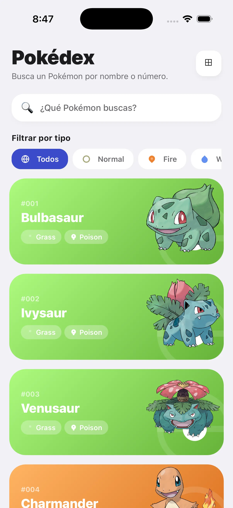</td>
  </tr>
  <tr>
    <td align="center"><b>Search & Filters</b></td>
    <td align="center"><b>Pokemon Detail</b></td>
  </tr>
  <tr>
    <td>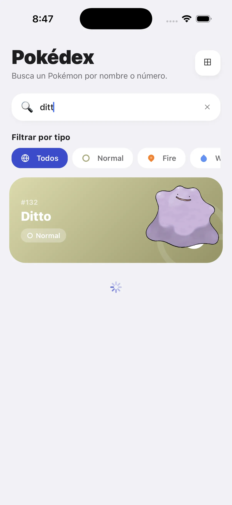</td>
    <td>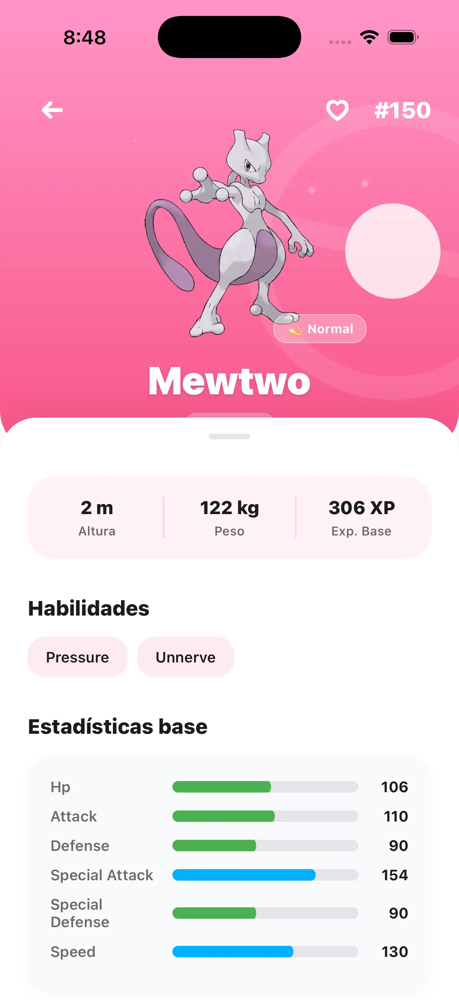</td>
  </tr>
    <tr>
    <td align="center"><b>Favorites</b></td>
    <td align="center"><b>Toggle Shiny</b></td>
  </tr>
  <tr>
    <td>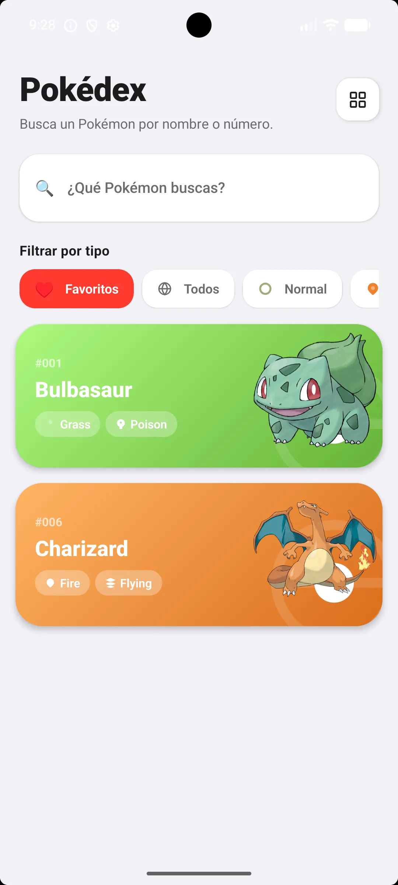</td>
    <td>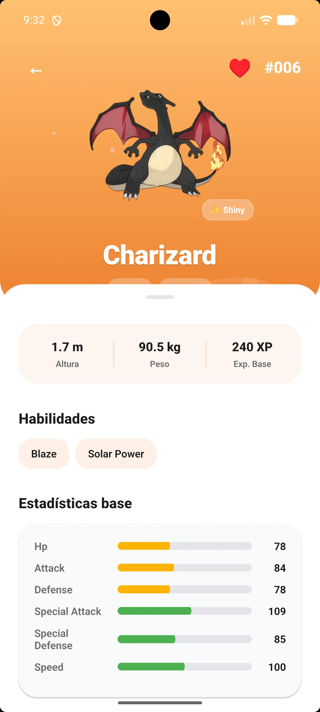</td>
  </tr>
</table>

## Architecture

The codebase is organized into four layers, with dependencies pointing inward toward `domain`:

```
src/
  app/            Expo Router — thin route adapters, no business logic
  core/           Composition root: DI (TSyringe), HTTP client, TanStack QueryClient
  domain/         Entities, repository contracts (interfaces), use cases
  data/           DTOs, datasources (remote: axios / local: MMKV), mappers, repository impl
  presentation/   Hooks ("ViewModels"), screens, components, theme
```

| Layer          | Responsibility                                                                 |
| -------------- | ------------------------------------------------------------------------------- |
| `domain`       | Business rules and contracts. No framework or infrastructure dependencies.     |
| `data`         | Implements domain contracts: remote/local datasources, mappers, repositories.  |
| `presentation` | UI and view state via custom hooks, decoupled from data-fetching internals.    |
| `app`          | Expo Router routes — wire screens to hooks, no logic of their own.             |
| `core`         | Composition root — DI container, HTTP client, query client configuration.      |

## Tech Stack

| Concern              | Choice                          | Notes                                                              |
| --------------------- | -------------------------------- | -------------------------------------------------------------------- |
| Navigation            | Expo Router (file-based)         | Stack: list → detail                                              |
| Networking            | Axios + TanStack Query           | Loading/error/success states + caching                             |
| Dependency Injection  | TSyringe                         | Explicit registration via `useFactory` in `src/core/di/container.ts` |
| Local persistence     | `react-native-mmkv`              | Read-through/write-through cache at the repository level, feeding `initialData` into TanStack Query (offline availability on relaunch) |
| Images                | `expo-image`                     | Native caching                                                     |
| Lists                 | `FlatList` (React Native)        | Virtualization + memoization                                       |

## Requirements

`react-native-mmkv` is a native module — **it does not work in Expo Go**. A dev client (native build) is required.

## Getting Started

```bash
pnpm install
pnpm run ios      # or: pnpm run android
```

Both commands run `expo run:ios` / `expo run:android`, which prebuild and compile the dev client automatically on first run. No additional manual steps are required.

Once the dev client is installed on the simulator/device, iterate faster with:

```bash
pnpm start        # expo start --dev-client
```

## Available Scripts

| Command             | Description                                     |
| -------------------- | ----------------------------------------------- |
| `pnpm start`          | Start Metro with the dev client                 |
| `pnpm run ios`        | Prebuild + run on iOS                           |
| `pnpm run android`    | Prebuild + run on Android                       |
| `pnpm run web`        | Start Expo for web                              |
| `pnpm run typecheck`  | `tsc --noEmit`                                  |
| `pnpm run lint`       | `eslint .`                                      |
| `pnpm run format`     | `prettier --write .`                            |
| `pnpm test`           | `jest --forceExit`                              |
| `pnpm run coverage`   | Run Jest tests and output coverage reports      |
| `pnpm run maestro:all` | Run all E2E Maestro flows                      |

## Testing & QA

Local QA gate, run in order before opening a PR:

```bash
pnpm run typecheck
pnpm run lint
pnpm test
pnpm run coverage
```

There is no CI pipeline configured yet — this sequence is the manual gate.

### Unit and Integration Tests (Jest)

Covers:

- **Domain use cases:** `GetPokemonListUseCase`, `GetPokemonDetailUseCase`, `ToggleFavoriteUseCase`
- **Data mappers and sources:** `pokemonMapper`, `PokemonLocalDataSourceImpl`, `FavoritesRepositoryImpl`
- **Repositories and Hooks:** `PokemonRepositoryImpl`, `usePokemonList`

Coverage is collected from `src/**/*.{ts,tsx}`, excluding `app/`, `presentation/components`, `presentation/screens`, `presentation/theme`, and test files themselves. Minimum thresholds enforced in `package.json`:

| Metric     | Threshold |
| ---------- | --------- |
| Branches   | 50%       |
| Functions  | 45%       |
| Lines      | 35%       |
| Statements | 35%       |

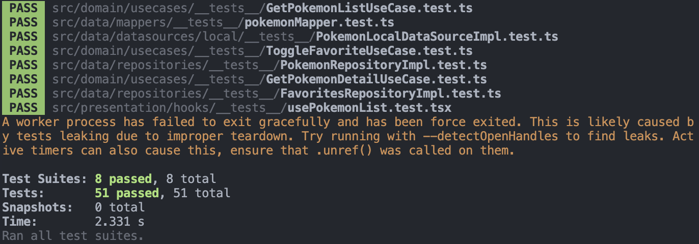

### End-to-End Tests (Maestro)

Maestro flows are defined in the `.maestro/` directory:

- **Splash Screen (`splash_screen.yaml`):** Verifies correct splash screen appearance, text, duration, and transition.
- **List and Navigation (`list_and_navigate.yaml`):** Verifies searching, tapping an item, and returning.
- **Favorites (`favorites.yaml`):** Verifies marking/unmarking favorites and persistence.
- **Type Filter (`type_filter.yaml`):** Verifies filtering list by type and resetting.
- **Scroll to Top (`scroll_to_top.yaml`):** Verifies that the scroll-to-top FAB appears on scroll down and successfully scrolls to the top.

<table align="center">
  <tr>
    <td align="center"><b>Splash Screen</b></td>
    <td align="center"><b>List & Navigate</b></td>
  </tr>
  <tr>
    <td>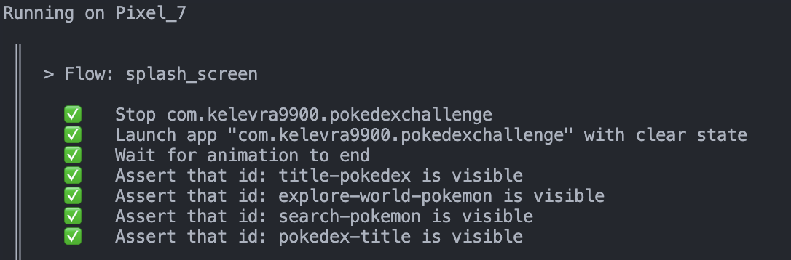</td>
    <td>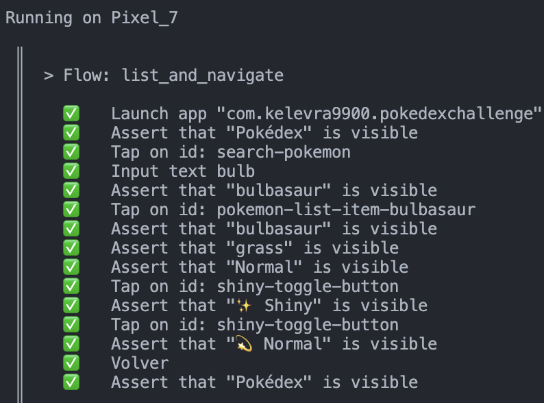</td>
  </tr>
  <tr>
    <td align="center"><b>Favorites</b></td>
    <td align="center"><b>Type Filter</b></td>
  </tr>
  <tr>
    <td>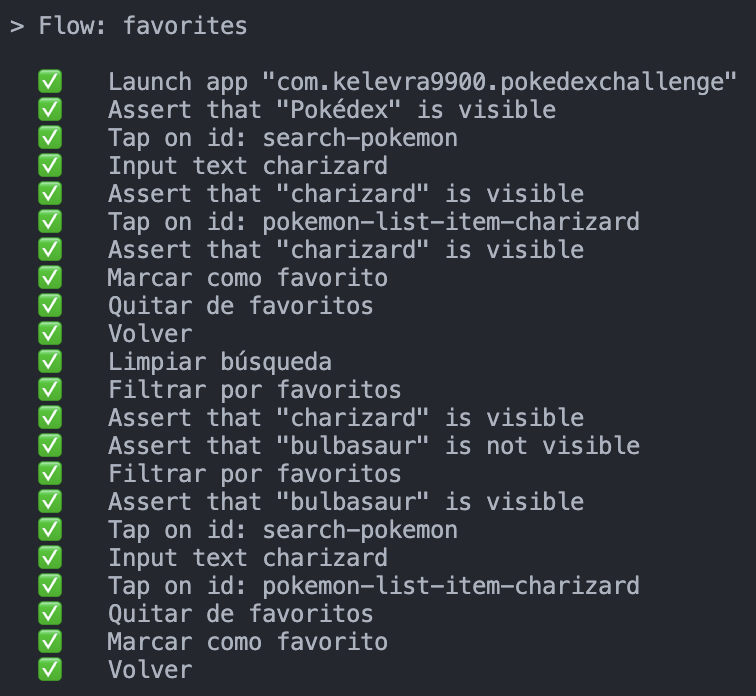</td>
    <td>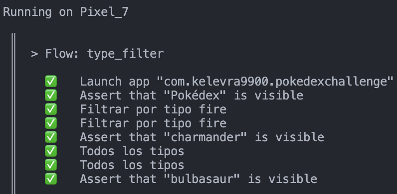</td>
  </tr>
  <tr>
    <td align="center"><b>Scroll to Top</b></td>
    <td></td>
  </tr>
  <tr>
    <td>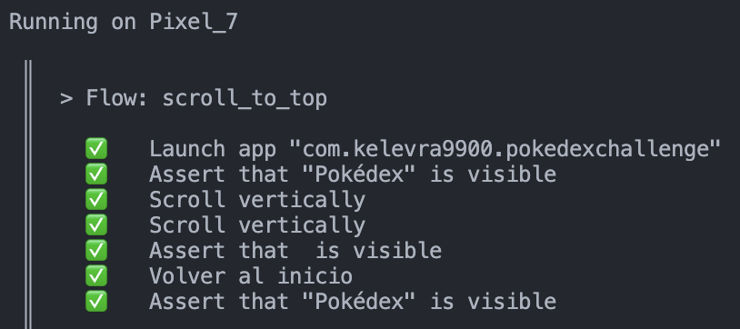</td>
    <td></td>
  </tr>
</table>

To run E2E flows (ensure the app is running on a simulator or device first):

```bash
# Run all E2E flows
pnpm run maestro:all

# Run specific E2E flows
pnpm run maestro:splash       # Splash Screen flow
pnpm run maestro:list         # List & Navigation flow
pnpm run maestro:favorites    # Favorites toggle & filter flow
pnpm run maestro:filter       # Type filters flow
pnpm run maestro:scroll       # Scroll to top FAB flow
```
